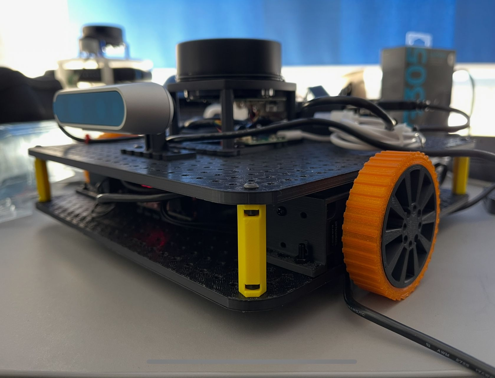

# OPENBOT Waffle



## 3D Preview

To preview the 3D model of the robot, you can use the following link: [OpenBot Waffle 3D Preview](https://cad.onshape.com/documents/e4455d89093a44267b1c8add/w/d262dbe7157cadda162aa249/e/e17b02729e8f8845fbf66276?renderMode=0&uiState=67bee99083113e444bfba18b)

## Packages description:

### BNO055_Driver
 - package cloned from https://github.com/the-hive-lab/bno055_driver 
 - to run independently the node that publishes the imu topic: ``` ros2 launch bno055_driver imu.launch.py ``` 
 - publishes in /imu topic

### Dynamixel_Hardware
 - package cloned from https://github.com/dynamixel-community/dynamixel_hardware/tree/jazzy (make sure clone branch jazzy)
 - hardware interface pacage for dynamixel motors
 - used for the dynamixel controller node

### imu_odom_fusion
 - package that fuses the imu and odometry data to publish the robot's pose
 - to run independently the node that publishes the robot's pose: ``` ros2 launch imu_odom_fusion ekf_launch.py ```
 - fusions using extended kalman filters imu readings from imu topic and odometry estimates from odom topic (published by the diff_drive_controller node based on wheel encoders) 
 - publishes in /odometry/filtered topic

### urdf_description
 - package that contains the robot's urdf description, differential drive controller and robot launch files
 - to publish the robot's urdf description: ``` ros2 launch urdf_description urdf_visualize.launch.py ```
 - to launch the robot launch file: ``` ros2 launch urdf_description robot.launch.py ```
    - launches the diff_drive_controller node that publishes the robot's odometry and listens to the cmd_vel topic to control the robot's movement
    - launches the joint_state_publisher node that publishes the robot's joint states
    - can launch the robot_state_publisher node that publishes the robot's tf tree (commented by default)
    - launches joint_state_bridge node that publishes the joint states in the /joint_states topic
    - launches lidar node that publishes the lidar data in the /scan topic (by default from /dev/ttyUSB1)
    - launches the imu_odom_fusion node that fuses the imu and odometry data to publish the robot's pose


### teleop_twist_keyboard
 - package cloned from https://github.com/ros-teleop/teleop_twist_keyboard
 - modified to work with twist stamped messages
 - to run the node that publishes the twist stamped messages: ``` ros2 run teleop_twist_keyboard teleop_twist_keyboard ```

### mapping
 - package that contains the launch file to run cartographer and the configuration files
 - to run cartographer: ``` ros2 launch mapping cartographer.launch.py ```
 - to publish the map: ``` ros2 launch mapping nav2_map_server.launch.py ``` (ignore if use the launch file from localization package)

### localization
 - package that contains the launch file to run amcl and the configuration files
 - to run amcl: ``` ros2 launch localization localizer.launch.py ```

### path_planning
 - package that contains the launch file to run nav2 path planning and the configuration files
 - to run nav2: ``` ros2 launch path_planning path_planner.launch.py ```

### openbot_waffle_gazebo
 - package that contains the launch file to run the gazebo simulation
 - to run the gazebo simulation: ``` ros2 launch openbot_waffle_gazebo robot_description_gazebo.launch.py ```

## Instructions

- the components list can be be found here: [List of Components Needed to Build OpenBot Waffle](docs/component_list.md)
- the 3D printing and assembly instructions can be found here: [Printing and Assembling Instructions for OpenBot Waffle](docs/3d_printing.md)
- the software installation instructions can be found here: [Software Installation Instructions for OpenBot Waffle](docs/software_installation.md)
- basic ros2 intructions can be found here: [ROS2 Basic Instructions](docs/ros2_basic.md)

## Demo Usage

- robot control, teleoperation and main packages: [Teleoperation for OpenBot Waffle](docs/teleoperation.md)
- gazebo simulation: [Gazebo Simulation for OpenBot Waffle](docs/gazebo_simulation.md)
- slam (mapping, localization and path planning): [SLAM for OpenBot Waffle](docs/slam.md)

# License

This project is licensed under the MIT License. See the LICENSE file for details.