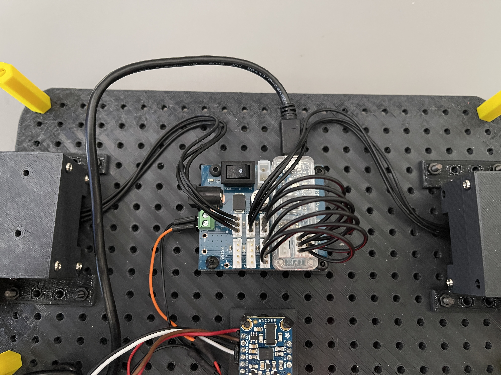
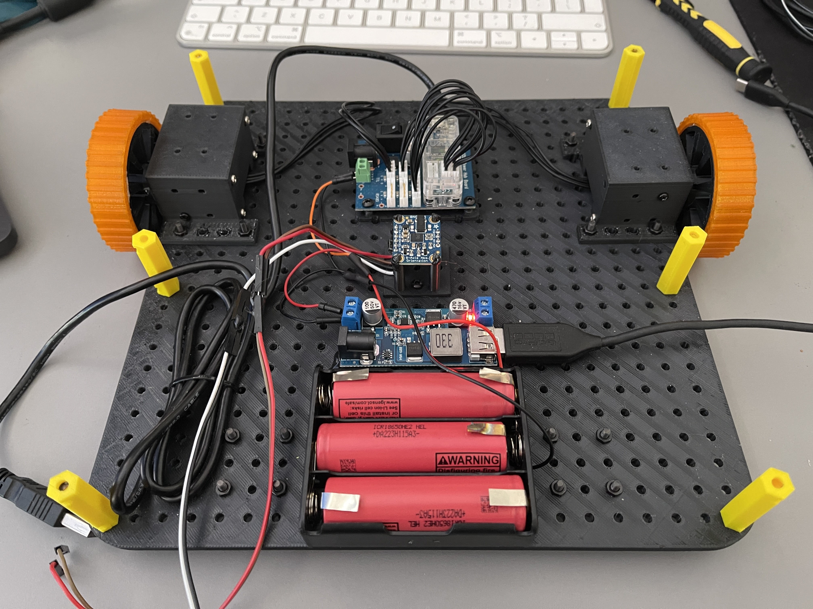
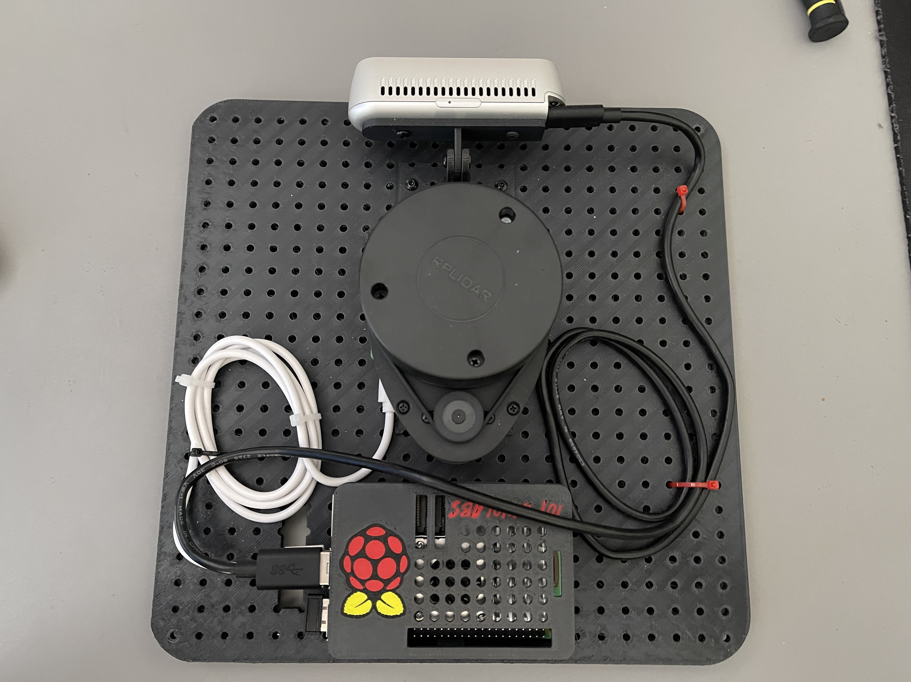
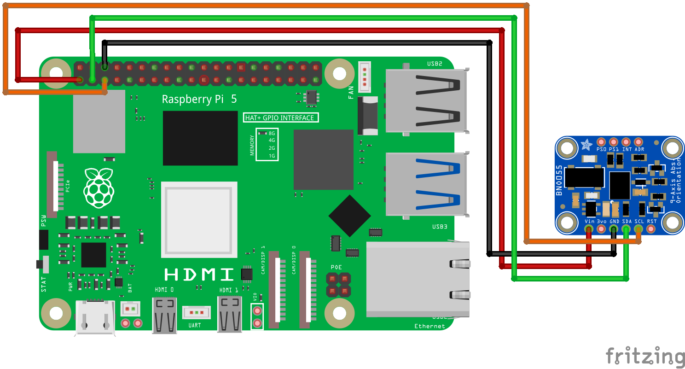

# Printing and assembling instructions for OpenBot Waffle

- To preview the 3D model of the robot, you can use the following link: [OpenBot Waffle 3D Preview](https://cad.onshape.com/documents/e4455d89093a44267b1c8add/w/d262dbe7157cadda162aa249/e/e17b02729e8f8845fbf66276?renderMode=0&uiState=67bee99083113e444bfba18f)

# 3D Priting

The files needed for 3D printing the OpenBot Waffle robot are available in the `3d_files` folder. 

## Files `base0` and `base1` can be printed only with printers with build plate of at least 256 x 256 mm. 

For 3D printing we've used a BambuLab X1C printer. If you are using a BambuLab printer (A1, P1S or X1C) you can open `openbot_waffle_bambu.3mf` with Bamabu Studio and start printing. For the tires you have to use TPU filament and for the rest of the parts PLA filament. 

If you are using a different printer, in the `all_files` subfolder you can find all the parts in 3mf format. Print the tires with TPU filament and the rest of the parts with PLA filament. The only pieces that need supports are rims and the XL430 holders. 

If you are printing each parts individually use the next table to know the quantity of each part needed:

| Part Name | Quantity |
| --- | --- |
| `base0` | 1 |
| `base1` | 1 |
| `caster_wheel` | 2 |
| `rim` | 2 |
| `tire` | 2 |
| `xl430_holder` | 2 |
| `spacer_35mm` | 6 |
| `depth_holder_A` | 1 |
| `depth_holder_B` | 1 |
| `holder_u2d2` | 1 |
| `lidar_holder` | 1 |
| `imu_holder` | 1 |
| `pi_case_A` | 1 |
| `pi_case_B` | 1 |

# Assembly - Start after printing all the parts

 ## Step 1 - Attach components to their holders

 - Fix the Dynamixel XL430 motors in the XL430 holders with the screws provided with the motors.
 - Glue the tires to the rims.
 - Fix the wheels to the motors with the screws provided with the motors (4 screws is enough).
 - Attach the IMU unit to the IMU holder (before fixing the imu to the holder, connect 4 arduino cables to the IMU, red to Vin, black to GND and other two to SCL and SDA pins).
 - Attach depth holder A and B with a screw and nut then fix the depth camera to the holder.
 - Attach the Lidar to the lidar holder.

## Step 2 - Fix the components on the bottom base plate

 - Both for base0 and base1, to fix the parts in the exact position, refer to the [3D model of the robot](https://cad.onshape.com/documents/e4455d89093a44267b1c8add/w/d262dbe7157cadda162aa249/e/e17b02729e8f8845fbf66276?renderMode=0&uiState=67bee99083113e444bfba18f)
 - Using 3mm screws and nuts fix the motors, imu (before fixing it attach 4 cables to its VCC, SCL, SDA and GND pins), battery holder and u2d2 module to the base0 part.
 - Connect the motors to the U2D2 module, in the next image you can see how the Dynamixel motors are wired to the U2D2 module. Leave a USB cable connected to the U2D2 module that later will be connected to the Raspberry Pi.
    
 - Glue the 5V 5A step down module to the base0 part.
 - Use zip ties to fix the cables to the plate.
 - Connect the battery holder to the 5V 5A step down module and to the U2D2 module. Leave an USB to Type C cablle connected to the 5V 5A step down module that later will power the Raspberry Pi. 
 - Make sure that the U2D2 module is powered directly from the battery since it needs 12 V to operate. If you power it from the 5V 5A step down module, it won't work.

 - Using 3mm screws and nuts fix the two caster wheels and six spacers to the base0 part.
 - After fixing all the components on the bottom plate, it should look like this:
    

## Step 3 - Assemble the top plate of the robot

 - Screw on the base1 part the depth camera and lidar.
 - Fix on the base1 the raspberry pi holder then fix the raspberry pi to the holder.
 - Use zip ties to fix the cables from the lidar and depth camera to the plate.
 - Connect the Lidar and Depth camera to the Raspberry Pi via USB.
 - In the next image you can see how the top plate of the robot should look like.
      

 ## Step 4 - Assemble the robot by connecting the top and bottom plates via the spacers

 - Connect the base0 part to the base1 part with screws and nuts via the spacers. Pass the arduino cables (for the IMU) and the Type C cable through the hole of the base1 part (the hole under the lidar). Pass the cable from the U2D2 module through the hole of the base1 part (the hole next to the Raspberry Pi USB ports).
 - Connect the IMU to the Raspberry Pi following the next image. Use the hole from the upper base to pass the cables.
 
 - Connect the U2D2 module to the Raspberry Pi via USB.

## Extra

 - When you are not using the robot, do not forget to remove the type C cable that powers it (even if you've turned off the raspberry pi). If you leave it connected, the battery will be drained in a few days (or even hours).  