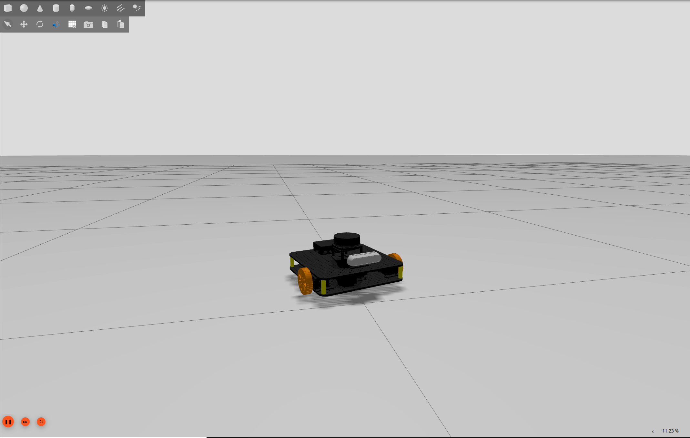
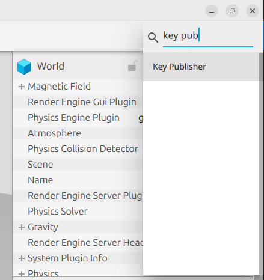
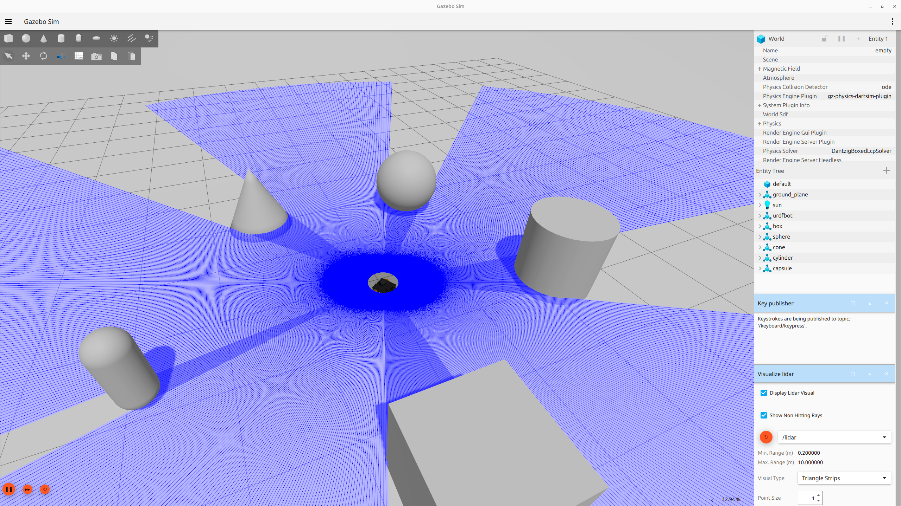
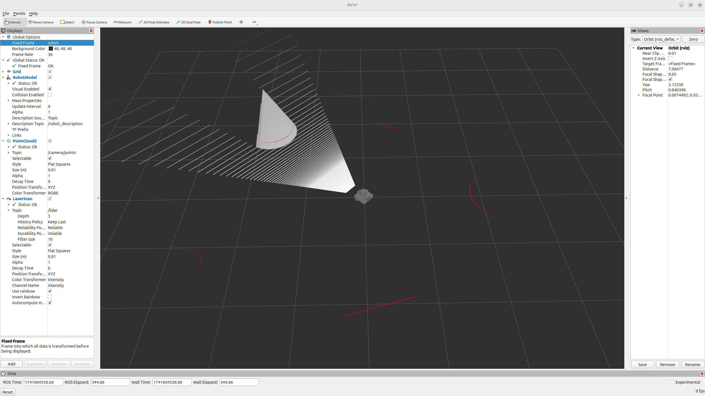

# Gazebo Simulation

## How to start the simulation

To start the simulation, after building and sourcing the project, simply run the command:
```
ros2 launch openbot_waffle_gazebo robot_description_gazebo.launch.py
```



- this will launch the Gazebo Simulator and will spawn the OpenBot Waffle into an empty world (as in the  image above)
- it bridges multiple topics from gazebo to ros2 to be able to view in Rviz2 what is the perception of the robot 
- to control the robot using "wasdx" keys from the keyboard, add in gazebo the key publisher from the top right dropdown after searching for it (as in the next image)




## Lidar and Depth camera

- similar to the key publisher, lidar visualization can be added in gazebo (do no forget to select the topic where the scans are published, in our case /lidar)
- after adding a few objects into the Gazebo World (similar to next figure), open rviz2 from a new terminal.



- add by topic in rviz2 the PointCloud2 depth readings from the simulated depth camera and the LaserScans from the lidar.



- you can observe how the readings from the lidar and the depth camera match each other. In our example, the robot is facing the cone and we can see the readings of the lidar are projected as expected on the cone, on level with the lidar of the robot.
- if you move the robot you can observe how the robot moves and the objects remain in the same spots on the visualization (make sure to use as fixed frame /odom in Rviz2)

## Extra

### Gazebo commands

 - To list all the gazebo topic run

```
gz topic -l
```

 - To view the informations about a specific topic (in this case /scan):
 
```
gz topic -t /scan -i
```
 - To echo a topic  (in this case /scan):
 
```
gz topic -t /scan -e
```
 - To publish messages in a topic (in this case in /cmd_vel)
 
```
gz topic -t /cmd_vel -m gz.msgs.Twist -p '
linear: { x: 0.2, y: 0.0, z: 0.0 }
angular: { x: 0.0, y: 0.0, z: 0.0 }'
```


### Bridging

Since we are using Gazebo Sim, to have a topic from ros2 to gazebo or from gazebo to ros2 we have to bridge them manually. When bridging a topic we have to specify the name of the topic and the type of messages (for both ros2 and gz) and the direction of the bridge. The Ros2 and Gz message type correspondets and be viewed [here](https://github.com/gazebosim/ros_gz/blob/ros2/ros_gz_bridge/README.md). Official docs: [here](https://gazebosim.org/docs/latest/ros2_integration/).

to bridge camera topic from gz to ros2: 
```
ros2 run ros_gz_bridge parameter_bridge /camera@sensor_msgs/msg/Image[gz.msgs.Image
```

### More

Official tutorial for simulating a differential steering robot in Gazebo:  https://gazebosim.org/docs/latest/building_robot/

Template for integrating ros2 and gazebo: https://github.com/gazebosim/ros_gz_project_template

