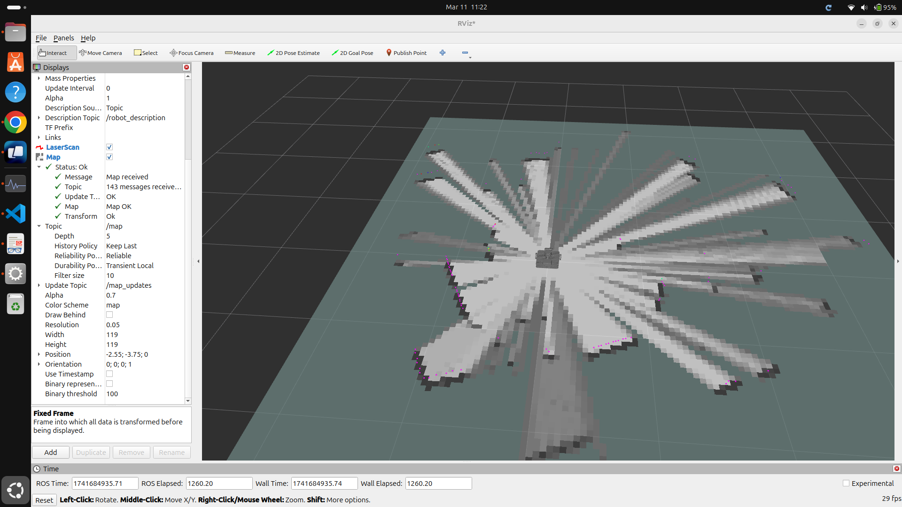
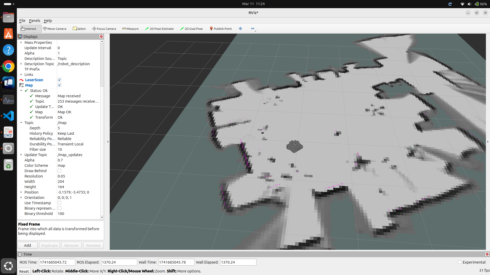
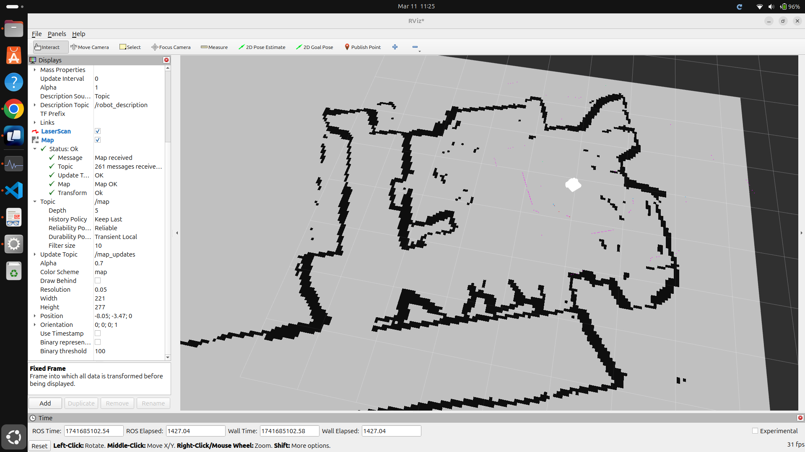
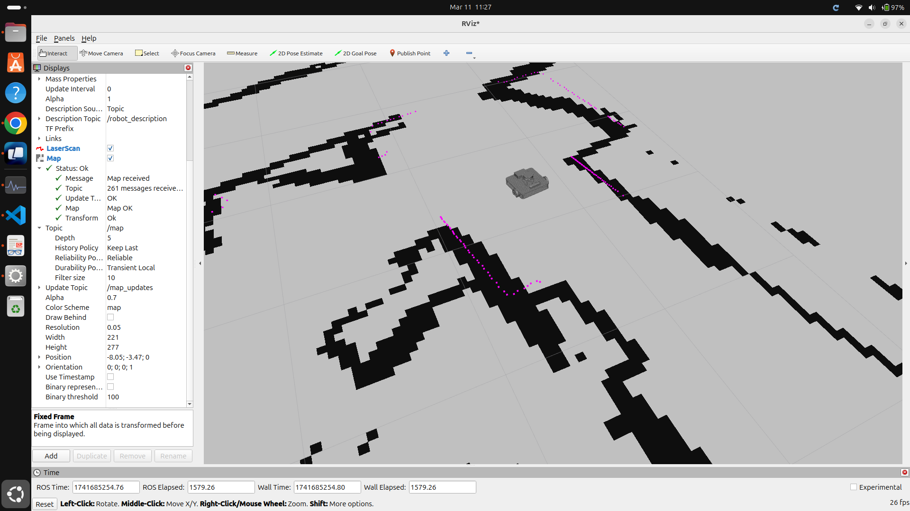
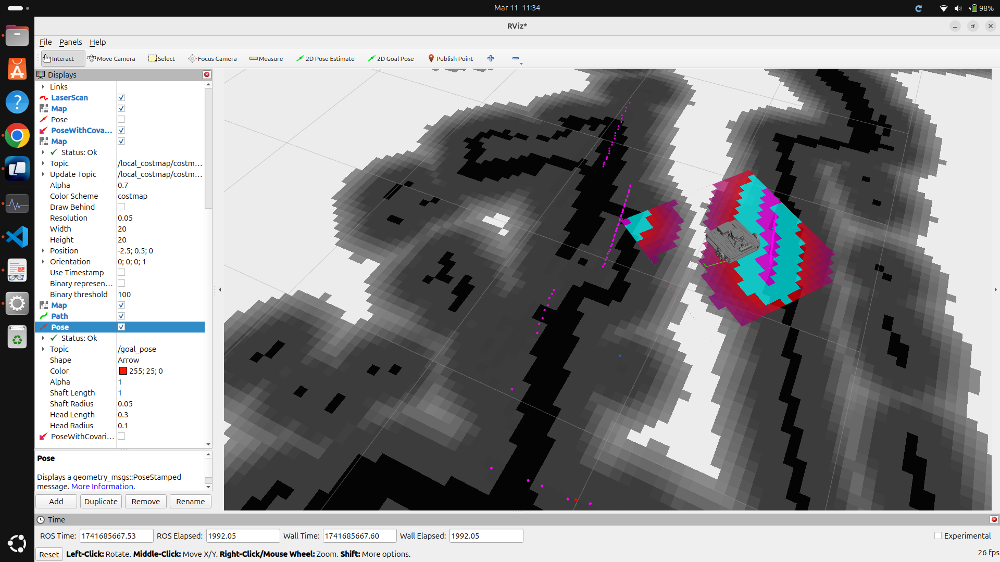
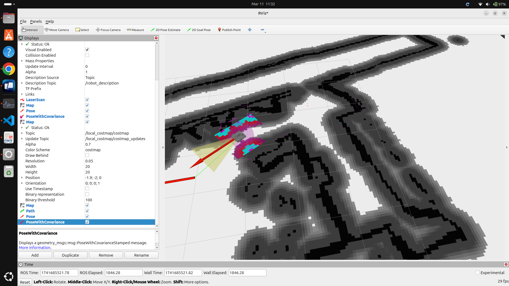

# Simultaneous Localization and Mapping (SLAM) Example with OpenBot Waffle

## Prerequisites

 - make sure that you've followed the [instructions for teleoperation and robot diff drive control](teleoperation.md) in order to be able to move the robot around

 - publish the robot's urdf description (preferably from external pc to be able to use Rviz2 with higher FPS) with: 
 ``` 
 ros2 launch urdf_description urdf_visualize.launch.py 
 ```

 - launch the robot launch file (directly from raspberry pi): 
 ``` 
 ros2 launch urdf_description robot.launch.py 
 ```

  - make sure thath the robot is publishing the odom topic and the lidar scans. This can be checked by running the next command and looking for /odom and /scans topics 
 ``` 
 ros2 topic list 
 ``` 

 - open a new terminal and launch rviz2: 
 ```
 rviz2 
 ```

 - add the robot model in rviz2 by clicking the Add button and selecting RobotModel. For the moment make sure that the Fixed frame is set to /odom or /base_link.

 - add the LaserScan by topic to visualize the lidar scans.


## Mapping
 - the scope of this is to create the map of the environment where the robot will navigate

 - to launch the cartographer node that will map your environment simply run: 
 ``` 
 ros2 launch mapping cartographer.launch.py 
 ```
 - after launching this node, the robot will start mapping the environment. The map can be visualized in rviz2 by adding the map topic. Make sure that in rviz2 the Fixed frame is set to /map, map topic is set to /map, the history policy to Keep Last, Reliability to Reliable and Durability Policy to Transient Local. In the next image you can see how the map looks when the robot starts mapping the environment. 

 

 - to map the environment the robot needs to moved around. This can be done by teleoperating the robot with the teleop_twist_keyboard node that can be launched with the next command: 
 ``` 
 ros2 run teleop_twist_keyboard teleop_twist_keyboard 
 ``` 

 - after covering the entire environment, the map should look similar to the next image. We suggest to move the robot in a way that the entire environment is covered and have as little as possible dynamic objects in the environment.

  

 - after you've completed mapping the environment, navigate into the config folder inside the mapping package and run the next command to save the map: 
 ``` 
 ros2 run nav2_map_server map_saver_cli -f <path_to_save_map> 
 ```

 - if you want to publish the map this can be done with the following command (ignore if use the launch file from localization package): 
 ``` 
 ros2 launch mapping nav2_map_server.launch.py 
 ``` 

## Localization
 - to localize the robot in the environment, the amcl (Adaptive Monte Carlo Localization) from nav2 package is used.

 - make sure that the name of the saved map is corectly set in the localization package launch file (localizer.launch.py).

 - launch the amcl node: 
 ``` 
 ros2 launch localization localizer.launch.py 
 ```

  

 - after launching this node, the robot will wait for the initial pose to be set. This can be done by clicking the 2D Pose Estimate button in rviz2 and setting the initial pose of the robot. Try to set the initial pose as close as possible to the real pose of the robot.

 - after setting the initial pose, the robot will start localizing itself in the environment. The estimated pose can be visualized in rviz2 by adding the PoseWithCovariance by topic. To better localize the robot, you can move the robot around  the environment. After giving the 2D Pose we suggest to simply rotate the robot in place to see how the robot drifts on the map till it localizes itself. When the robot localized itself correctly the lidar scans will match the map (view next image).

  

 - when the robot is localized corectly you can move to the path planning step.

## Path Planning
 - to plan the path for the robot, the nav2 package is used.

 - to run the path planning node: 
 ``` 
 ros2 launch path_planning path_planner.launch.py 
 ```

 - to better view what is happening you can add by topic in Rviz2 the local costmap, global costmap, and the planned path and the goal pose.

 - in the next image can be seen the global costmap (in gray) and the local costmap (in colors)

 

 - after launching this node, the robot will wait for the goal to be set. This can be done by clicking the 2D Nav Goal button in rviz2 and setting the goal pose of the robot. Now the robot will start planning the path to the goal and will start moving towards it.

 

 - in the terminal were you've launched the path planning node, you will see the updated the status of navigation.