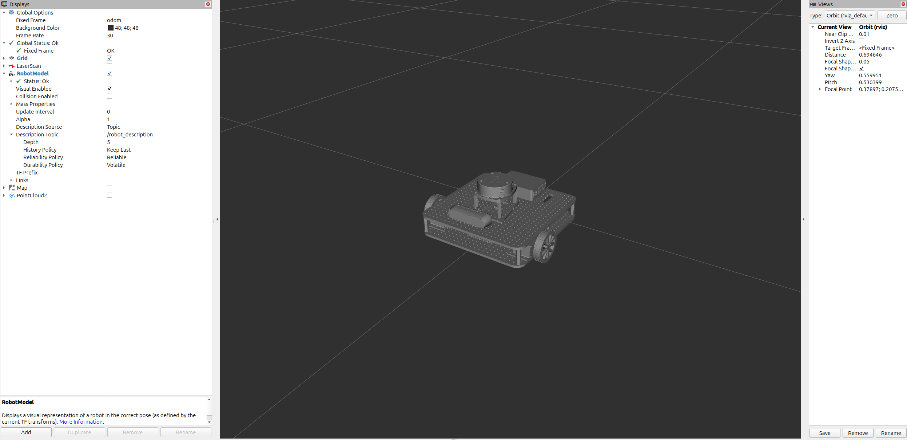
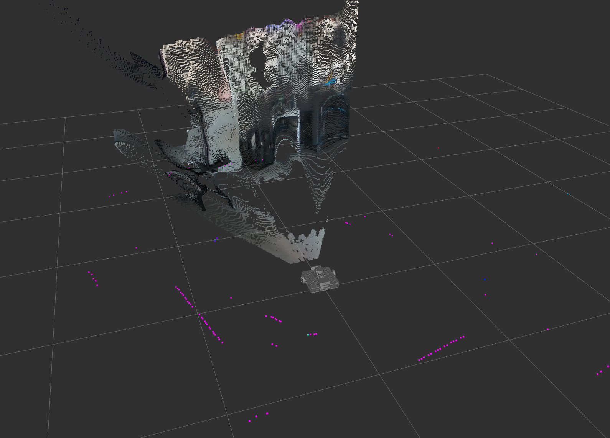

# Openbot Waffle base packages and teleoperation

This instruction will guide you through the process of getting the robot up and running with the main packages and how to teleoperate the robot via the keyboard or joystick. Also, it will show you how to visualize the robot in RVIZ2.

This project uses ROS2 Control in combination with a custom hardware interface based on the [dynamixel_hardware](https://github.com/dynamixel-community/dynamixel_hardware/tree/jazzy) package that listens for TwistStamped messages on the `/cmd_vel` topic and sends velocity commands to the Dynamixel motors.

## Prerequisites to launch the robot main packages

Firstly on the computer where you will run RVIZ2 launch the robot state publisher node that publishes the robot's tf tree. This can be done by running the following command:

```
ros2 launch urdf_description urdf_visualize.launch.py
```

Then on the Raspberry Pi (robot), launch the robot launch file that starts the diff_drive_controller node that publishes the robot's odometry and listens to the `/cmd_vel` topic to control the robot's movement. This can be done by running the following command:

```
ros2 launch urdf_description robot.launch.py
```

### What does this launch file do?

- Launches the diff_drive_controller node that listens to the `/cmd_vel` topic to control the robot's movement
- Launches the joint_state_publisher node that publishes the robot's joint states to the `/joint_states` topic
- Launches the imu_node that publishes the imu data from BNO055 sensor to the `/imu` topic
- Launches the lidar_node that publishes the lidar data from the RPLidar A1 to the `/scan` topic
- Launches the imu_odom_fusion node that fuses the imu and odometry data to publish the robot's pose to the `/odometry/filtered` topic
- Launches the realsense2_camera node that publishes the RGB and depth images from the RealSense D435 camera
- Launches the tf2_ros static_transform_publisher node that publishes the static transform between the camera and the robot's base_link frame

If all the nodes are launched successfully, you should see the robot's URDF model in RVIZ2 and be able to control the robot using the teleop_twist_keyboard node following the instructions below. If you didn't connect the Lidar or the IMU sensor you should expect to see specific errors in the terminal but the robot should still be able to move. 

### How to visualize the robot in RVIZ2?

To visualize the robot in RVIZ2, run the following command in a new terminal:

```
rviz2
```

When RVIZ2 starts, click on the "Add" button in the bottom left corner of the window and RobotModel. To be able to see the robot set the robot description to /robot_description and the fixed frame to odom. In the next image, you can see the robot in RVIZ2 (refer to the images on the left side to see the settings for the RobotModel).

 

To see the scans from the Lidar, add by topic the lidar scans. To see the camera images, add by topic the PointCloud2 under camera/camera/depth/color/points topic. In the next image you can see the robot along with the lidar scans (pink points) and the camera readings (RGB and depth images) projected in the 3D space.

  

## Keyboard Teleoperation

Teleoperation is provided via a modified version of the [teleop_twist_keyboard](https://github.com/ros-teleop/teleop_twist_keyboard) package that now publishes TwistStamped message to control the robot.

To start teleoperating the robot, run the following command in your terminal:

```
ros2 run teleop_twist_keyboard teleop_twist_keyboard
```

When the node starts, use your keyboard according to the on-screen instructions to control the robot. When pressing 'i' the robot will move forward, ',<' to move backward, 'j' to rotate left, and 'l' to rotate right and 'k' to stop the robot.

You can also publish TwistStamped messages directly to the `/cmd_vel` topic to control the robot. For example, to move the robot forward at a linear velocity of 0.1 m/s and an angular velocity of 0.1 rad/s, run the following command:

```
ros2 topic pub /cmd_vel geometry_msgs/msg/TwistStamped '{
  header: {
    stamp: { sec: 0, nanosec: 0 },
    frame_id: ""
  },
  twist: {
    linear: { x: 0.1, y: 0.0, z: 0.0 },
    angular: { x: 0.0, y: 0.0, z: 0.1 }
  }
}'
```

## Joystick Teleoperation

Teleoperation can also be done using a joystick. To start teleoperating the robot with a joystick, run the following command in your terminal:

```
ros2 launch urdf_description diff_drive_control.xacro
```

When the node starts, use your joystick to control the robot. The robot will move according to the left joystick and if you want to move the robot faster (boost mode) you can press R2 button.

This node is inspired from Articulated Robotics. 
 - [Youtube Video](https://www.youtube.com/watch?v=F5XlNiCKbrY)
 - [Github Repository](https://github.com/joshnewans/articubot_one/tree/174b3f311ab146ef12c6549ad0640cb985854972)


